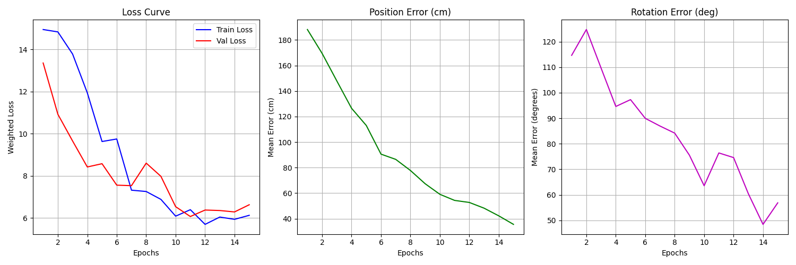
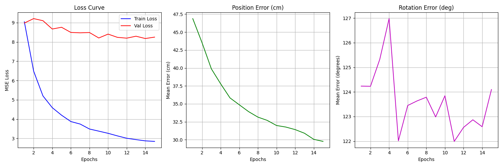

## baseline result

Epoch 1 Summary: Train Loss: 0.1983 | Val Loss: 0.1665
Epoch 2/10: 100%|███████████████████████████████████████████████████████████████████████████████████████████████████████████████████████████████████| 125/125 [00:33<00:00,  3.74it/s, Loss=0.0735]
Epoch 2 Summary: Train Loss: 0.0835 | Val Loss: 0.1804
Epoch 3/10: 100%|███████████████████████████████████████████████████████████████████████████████████████████████████████████████████████████████████| 125/125 [00:38<00:00,  3.26it/s, Loss=0.0387]
Epoch 3 Summary: Train Loss: 0.0364 | Val Loss: 0.1741
Epoch 4/10: 100%|███████████████████████████████████████████████████████████████████████████████████████████████████████████████████████████████████| 125/125 [00:33<00:00,  3.74it/s, Loss=0.0194]
Epoch 4 Summary: Train Loss: 0.0234 | Val Loss: 0.1693
Epoch 5/10: 100%|███████████████████████████████████████████████████████████████████████████████████████████████████████████████████████████████████| 125/125 [00:34<00:00,  3.57it/s, Loss=0.0185]
Epoch 5 Summary: Train Loss: 0.0199 | Val Loss: 0.1626
Epoch 6/10: 100%|███████████████████████████████████████████████████████████████████████████████████████████████████████████████████████████████████| 125/125 [00:35<00:00,  3.56it/s, Loss=0.0172]
Epoch 6 Summary: Train Loss: 0.0192 | Val Loss: 0.1653
Epoch 7/10: 100%|███████████████████████████████████████████████████████████████████████████████████████████████████████████████████████████████████| 125/125 [00:30<00:00,  4.16it/s, Loss=0.0224]
Epoch 7 Summary: Train Loss: 0.0170 | Val Loss: 0.1627
Epoch 8/10: 100%|███████████████████████████████████████████████████████████████████████████████████████████████████████████████████████████████████| 125/125 [00:33<00:00,  3.72it/s, Loss=0.0114]
Epoch 8 Summary: Train Loss: 0.0169 | Val Loss: 0.1603
Epoch 9/10: 100%|███████████████████████████████████████████████████████████████████████████████████████████████████████████████████████████████████| 125/125 [00:30<00:00,  4.13it/s, Loss=0.0241]
Epoch 9 Summary: Train Loss: 0.0159 | Val Loss: 0.1578
Epoch 10/10: 100%|██████████████████████████████████████████████████████████████████████████████████████████████████████████████████████████████████| 125/125 [00:37<00:00,  3.31it/s, Loss=0.0192]
Epoch 10 Summary: Train Loss: 0.0161 | Val Loss: 0.1555
训练完成，模型已保存！

### 分析
现在严重过拟合，Train Loss (0.016) 很低，说明模型有力气，能把训练数据背下来。
Val Loss (0.155) 很高，是训练误差的 10倍。
这在机器学习中有一个专用术语：严重过拟合 (Severe Overfitting)。
意思是：老师教过的题（训练集）模型全会背了，但稍微换个数字（验证集）它就不会了。

## hybrid result
开始训练... 设备: cuda
Epoch 1/10: 100%|████████████████████████████████████████████████████████████████████████████████████████████████████████████████████████████████████| 125/125 [00:30<00:00,  4.09it/s, Loss=0.136]
Epoch 1 Summary: Train Loss: 0.1420 | Val Loss: 0.1334
Epoch 2/10: 100%|████████████████████████████████████████████████████████████████████████████████████████████████████████████████████████████████████| 125/125 [00:36<00:00,  3.40it/s, Loss=0.125]
Epoch 2 Summary: Train Loss: 0.1189 | Val Loss: 0.1433
Epoch 3/10: 100%|███████████████████████████████████████████████████████████████████████████████████████████████████████████████████████████████████| 125/125 [00:30<00:00,  4.09it/s, Loss=0.0674]
Epoch 3 Summary: Train Loss: 0.0714 | Val Loss: 0.1644
Epoch 4/10: 100%|███████████████████████████████████████████████████████████████████████████████████████████████████████████████████████████████████| 125/125 [00:32<00:00,  3.82it/s, Loss=0.0363]
Epoch 4 Summary: Train Loss: 0.0403 | Val Loss: 0.1595
Epoch 5/10: 100%|███████████████████████████████████████████████████████████████████████████████████████████████████████████████████████████████████| 125/125 [00:28<00:00,  4.31it/s, Loss=0.0295]
Epoch 5 Summary: Train Loss: 0.0257 | Val Loss: 0.1579
Epoch 6/10: 100%|███████████████████████████████████████████████████████████████████████████████████████████████████████████████████████████████████| 125/125 [00:29<00:00,  4.24it/s, Loss=0.0184]
Epoch 6 Summary: Train Loss: 0.0197 | Val Loss: 0.1593
Epoch 7/10: 100%|███████████████████████████████████████████████████████████████████████████████████████████████████████████████████████████████████| 125/125 [00:31<00:00,  3.96it/s, Loss=0.0123]
Epoch 7 Summary: Train Loss: 0.0166 | Val Loss: 0.1589
Epoch 8/10: 100%|███████████████████████████████████████████████████████████████████████████████████████████████████████████████████████████████████| 125/125 [00:31<00:00,  4.02it/s, Loss=0.0141]
Epoch 8 Summary: Train Loss: 0.0152 | Val Loss: 0.1577
Epoch 9/10: 100%|███████████████████████████████████████████████████████████████████████████████████████████████████████████████████████████████████| 125/125 [00:29<00:00,  4.22it/s, Loss=0.0134]
Epoch 9 Summary: Train Loss: 0.0144 | Val Loss: 0.1599
Epoch 10/10: 100%|███████████████████████████████████████████████████████████████████████████████████████████████████████████████████████████████████| 125/125 [00:31<00:00,  4.03it/s, Loss=0.017]
Epoch 10 Summary: Train Loss: 0.0138 | Val Loss: 0.1607
训练完成，模型已保存！

### 分析：过拟合，训练集无敌，验证集拉胯

## hybrid result 调高了dropout
Epoch 10 Summary: Train Loss: 0.0355 | Val Loss: 0.1676

### 欠拟合/难优化 正则化太强模型学不动了

 
## 1218 用切片数据进行学习，第一次效果如下
✅ 加载完成，共 5000 张 RGB 图片。
🚀 开始训练 RGB 模型 | Device: cuda
配置: Alpha(Rot)=20.0, Epochs=15
Epoch 1/15: 100%|████████████████████████████████████████████████████████████████████████████████████████████████████████████████████████████████████| 125/125 [00:35<00:00,  3.51it/s, Lt=0.0614, Lq=0.4355]
📝 Epoch 1 Summary:
   Train Loss: 9.1840 | Val Loss: 9.3680
   >>> Err Pos: 46.47 cm | Err Rot: 127.49 deg
   💾 New Best Model Saved!
Epoch 2/15: 100%|████████████████████████████████████████████████████████████████████████████████████████████████████████████████████████████████████| 125/125 [00:27<00:00,  4.60it/s, Lt=0.0627, Lq=0.3616]
📝 Epoch 2 Summary:
   Train Loss: 6.9538 | Val Loss: 8.8699
   >>> Err Pos: 40.23 cm | Err Rot: 122.96 deg
   💾 New Best Model Saved!
Epoch 3/15: 100%|████████████████████████████████████████████████████████████████████████████████████████████████████████████████████████████████████| 125/125 [00:27<00:00,  4.51it/s, Lt=0.0554, Lq=0.2686]
📝 Epoch 3 Summary:
   Train Loss: 5.6435 | Val Loss: 8.6846
   >>> Err Pos: 38.95 cm | Err Rot: 124.41 deg
   💾 New Best Model Saved!
Epoch 4/15: 100%|████████████████████████████████████████████████████████████████████████████████████████████████████████████████████████████████████| 125/125 [00:26<00:00,  4.72it/s, Lt=0.0557, Lq=0.2423]
📝 Epoch 4 Summary:
   Train Loss: 4.8275 | Val Loss: 8.7060
   >>> Err Pos: 38.35 cm | Err Rot: 123.80 deg
Epoch 5/15: 100%|████████████████████████████████████████████████████████████████████████████████████████████████████████████████████████████████████| 125/125 [00:27<00:00,  4.63it/s, Lt=0.0416, Lq=0.2200]
📝 Epoch 5 Summary:
   Train Loss: 4.4216 | Val Loss: 8.5525
   >>> Err Pos: 36.21 cm | Err Rot: 124.99 deg
   💾 New Best Model Saved!
Epoch 6/15: 100%|████████████████████████████████████████████████████████████████████████████████████████████████████████████████████████████████████| 125/125 [00:27<00:00,  4.55it/s, Lt=0.0325, Lq=0.1901]
📝 Epoch 6 Summary:
   Train Loss: 4.0102 | Val Loss: 8.5284
   >>> Err Pos: 33.92 cm | Err Rot: 125.21 deg
   💾 New Best Model Saved!
Epoch 7/15: 100%|████████████████████████████████████████████████████████████████████████████████████████████████████████████████████████████████████| 125/125 [00:26<00:00,  4.78it/s, Lt=0.0287, Lq=0.2087]
📝 Epoch 7 Summary:
   Train Loss: 3.7898 | Val Loss: 8.6071
   >>> Err Pos: 33.41 cm | Err Rot: 124.75 deg
Epoch 8/15: 100%|████████████████████████████████████████████████████████████████████████████████████████████████████████████████████████████████████| 125/125 [00:25<00:00,  4.81it/s, Lt=0.0331, Lq=0.1910]
📝 Epoch 8 Summary:
   Train Loss: 3.6295 | Val Loss: 8.4418
   >>> Err Pos: 32.50 cm | Err Rot: 124.82 deg
   💾 New Best Model Saved!
Epoch 9/15: 100%|████████████████████████████████████████████████████████████████████████████████████████████████████████████████████████████████████| 125/125 [00:25<00:00,  4.85it/s, Lt=0.0366, Lq=0.1571]
📝 Epoch 9 Summary:
   Train Loss: 3.3981 | Val Loss: 8.5710
   >>> Err Pos: 31.84 cm | Err Rot: 123.88 deg
Epoch 10/15: 100%|███████████████████████████████████████████████████████████████████████████████████████████████████████████████████████████████████| 125/125 [00:26<00:00,  4.77it/s, Lt=0.0292, Lq=0.1400]
📝 Epoch 10 Summary:
   Train Loss: 3.2471 | Val Loss: 8.3546
   >>> Err Pos: 31.13 cm | Err Rot: 123.91 deg
   💾 New Best Model Saved!
Epoch 11/15: 100%|███████████████████████████████████████████████████████████████████████████████████████████████████████████████████████████████████| 125/125 [00:25<00:00,  4.92it/s, Lt=0.0321, Lq=0.1314]
📝 Epoch 11 Summary:
   Train Loss: 3.1498 | Val Loss: 8.4193
   >>> Err Pos: 31.69 cm | Err Rot: 125.42 deg
Epoch 12/15: 100%|███████████████████████████████████████████████████████████████████████████████████████████████████████████████████████████████████| 125/125 [00:26<00:00,  4.76it/s, Lt=0.0309, Lq=0.1314]
📝 Epoch 12 Summary:
   Train Loss: 3.0228 | Val Loss: 8.3621
   >>> Err Pos: 30.45 cm | Err Rot: 125.26 deg
Epoch 13/15: 100%|███████████████████████████████████████████████████████████████████████████████████████████████████████████████████████████████████| 125/125 [00:24<00:00,  5.02it/s, Lt=0.0240, Lq=0.1516]
📝 Epoch 13 Summary:
   Train Loss: 2.9199 | Val Loss: 8.3785
   >>> Err Pos: 30.37 cm | Err Rot: 124.23 deg
Epoch 14/15: 100%|███████████████████████████████████████████████████████████████████████████████████████████████████████████████████████████████████| 125/125 [00:27<00:00,  4.56it/s, Lt=0.0255, Lq=0.1175]
📝 Epoch 14 Summary:
   Train Loss: 2.8848 | Val Loss: 8.2987
   >>> Err Pos: 30.03 cm | Err Rot: 121.95 deg
   💾 New Best Model Saved!
Epoch 15/15: 100%|███████████████████████████████████████████████████████████████████████████████████████████████████████████████████████████████████| 125/125 [00:22<00:00,  5.68it/s, Lt=0.0319, Lq=0.1064]
📝 Epoch 15 Summary:
   Train Loss: 2.8735 | Val Loss: 8.3231
   >>> Err Pos: 29.68 cm | Err Rot: 123.80 deg

输出曲线结果如下：

#### baseline验证
Epoch 1/15: 100%|███████████████████████████████████████████████████████████████████████████████████████████████████████████████████████████████████████████████| 125/125 [00:46<00:00,  2.71it/s, Loss=8.24]
📝 Epoch 1 Summary:
   Train Loss: 9.0483 | Val Loss: 8.9817
   >>> Err Pos: 46.88 cm | Err Rot: 124.24 deg
Epoch 2/15: 100%|███████████████████████████████████████████████████████████████████████████████████████████████████████████████████████████████████████████████| 125/125 [00:41<00:00,  3.04it/s, Loss=6.92]
📝 Epoch 2 Summary:
   Train Loss: 6.4851 | Val Loss: 9.2111
   >>> Err Pos: 43.51 cm | Err Rot: 124.23 deg
Epoch 3/15: 100%|███████████████████████████████████████████████████████████████████████████████████████████████████████████████████████████████████████████████| 125/125 [00:31<00:00,  3.91it/s, Loss=5.81]
📝 Epoch 3 Summary:
   Train Loss: 5.2015 | Val Loss: 9.1030
   >>> Err Pos: 39.88 cm | Err Rot: 125.33 deg
Epoch 4/15: 100%|███████████████████████████████████████████████████████████████████████████████████████████████████████████████████████████████████████████████| 125/125 [00:31<00:00,  4.01it/s, Loss=4.65]
📝 Epoch 4 Summary:
   Train Loss: 4.5931 | Val Loss: 8.6712
   >>> Err Pos: 37.79 cm | Err Rot: 126.98 deg
Epoch 5/15: 100%|███████████████████████████████████████████████████████████████████████████████████████████████████████████████████████████████████████████████| 125/125 [00:34<00:00,  3.59it/s, Loss=3.94]
📝 Epoch 5 Summary:
   Train Loss: 4.2008 | Val Loss: 8.7619
   >>> Err Pos: 35.83 cm | Err Rot: 122.01 deg
Epoch 6/15: 100%|███████████████████████████████████████████████████████████████████████████████████████████████████████████████████████████████████████████████| 125/125 [00:33<00:00,  3.68it/s, Loss=4.15]
📝 Epoch 6 Summary:
   Train Loss: 3.8717 | Val Loss: 8.4941
   >>> Err Pos: 34.87 cm | Err Rot: 123.45 deg
Epoch 7/15: 100%|███████████████████████████████████████████████████████████████████████████████████████████████████████████████████████████████████████████████| 125/125 [00:31<00:00,  3.95it/s, Loss=4.17]
📝 Epoch 7 Summary:
   Train Loss: 3.7414 | Val Loss: 8.4744
   >>> Err Pos: 33.92 cm | Err Rot: 123.63 deg
Epoch 8/15: 100%|███████████████████████████████████████████████████████████████████████████████████████████████████████████████████████████████████████████████| 125/125 [00:34<00:00,  3.58it/s, Loss=3.37]
📝 Epoch 8 Summary:
   Train Loss: 3.4848 | Val Loss: 8.4892
   >>> Err Pos: 33.15 cm | Err Rot: 123.79 deg
Epoch 9/15: 100%|████████████████████████████████████████████████████████████████████████████████████████████████████████████████████████████████████████████████| 125/125 [00:33<00:00,  3.73it/s, Loss=3.2]
📝 Epoch 9 Summary:
   Train Loss: 3.3742 | Val Loss: 8.2063
   >>> Err Pos: 32.70 cm | Err Rot: 122.98 deg
Epoch 10/15: 100%|██████████████████████████████████████████████████████████████████████████████████████████████████████████████████████████████████████████████| 125/125 [00:32<00:00,  3.86it/s, Loss=3.14]
📝 Epoch 10 Summary:
   Train Loss: 3.2614 | Val Loss: 8.4076
   >>> Err Pos: 31.99 cm | Err Rot: 123.84 deg
Epoch 11/15: 100%|██████████████████████████████████████████████████████████████████████████████████████████████████████████████████████████████████████████████| 125/125 [00:28<00:00,  4.46it/s, Loss=2.66]
📝 Epoch 11 Summary:
   Train Loss: 3.1283 | Val Loss: 8.2395
   >>> Err Pos: 31.77 cm | Err Rot: 121.99 deg
Epoch 12/15: 100%|███████████████████████████████████████████████████████████████████████████████████████████████████████████████████████████████████████████████| 125/125 [00:28<00:00,  4.37it/s, Loss=3.3]
📝 Epoch 12 Summary:
   Train Loss: 3.0054 | Val Loss: 8.1971
   >>> Err Pos: 31.42 cm | Err Rot: 122.56 deg
Epoch 13/15: 100%|███████████████████████████████████████████████████████████████████████████████████████████████████████████████████████████████████████████████| 125/125 [00:28<00:00,  4.42it/s, Loss=2.6]
📝 Epoch 13 Summary:
   Train Loss: 2.9346 | Val Loss: 8.2978
   >>> Err Pos: 30.91 cm | Err Rot: 122.87 deg
Epoch 14/15: 100%|██████████████████████████████████████████████████████████████████████████████████████████████████████████████████████████████████████████████| 125/125 [00:28<00:00,  4.37it/s, Loss=2.36]
📝 Epoch 14 Summary:
   Train Loss: 2.8703 | Val Loss: 8.1783
   >>> Err Pos: 30.06 cm | Err Rot: 122.59 deg
Epoch 15/15: 100%|███████████████████████████████████████████████████████████████████████████████████████████████████████████████████████████████████████████████| 125/125 [00:29<00:00,  4.25it/s, Loss=3.2]
📝 Epoch 15 Summary:
   Train Loss: 2.8422 | Val Loss: 8.2511
   >>> Err Pos: 29.77 cm | Err Rot: 124.10 deg

